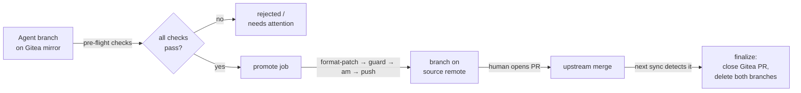
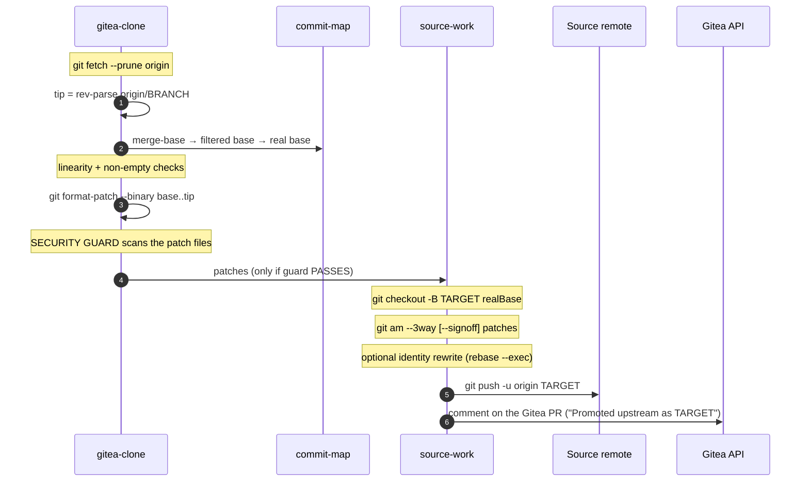
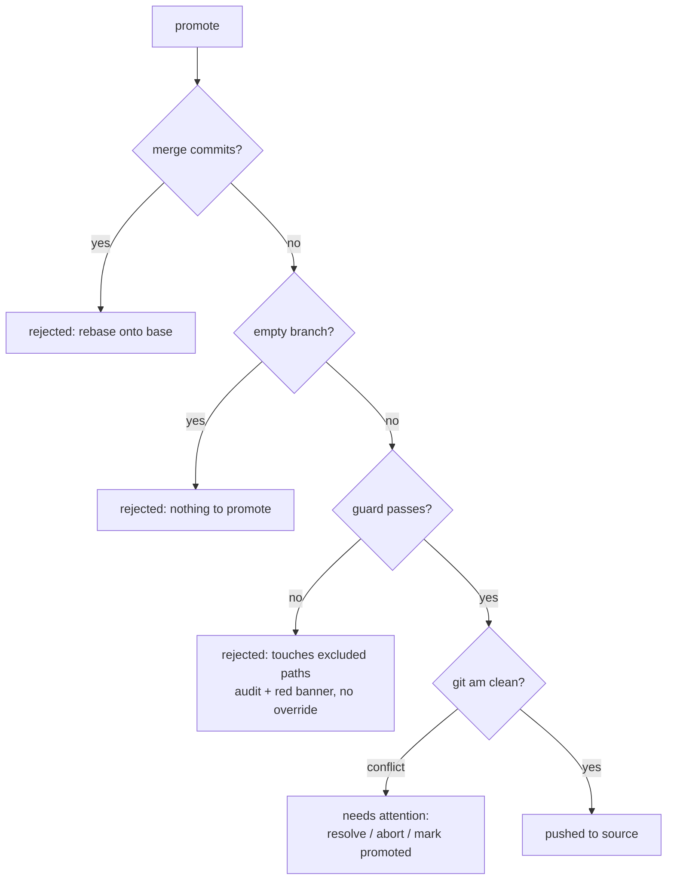
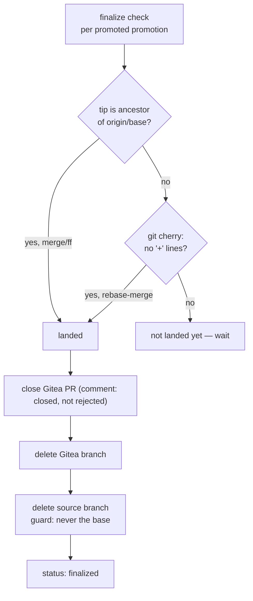
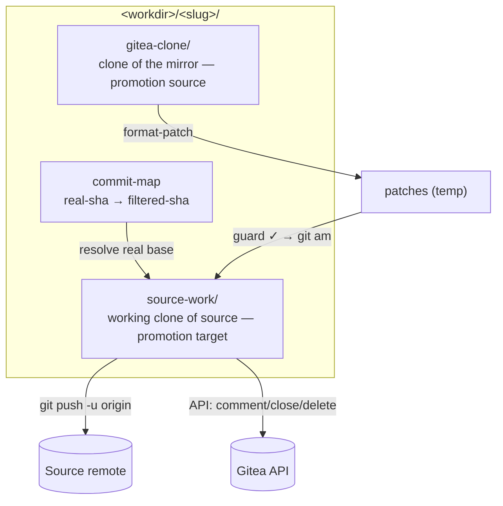

# How promotion works

Promotion is the **Gitea → source** direction of a bridge — the return path.
It takes an approved agent branch from the filtered Gitea mirror, replays its
commits onto the **real** (unfiltered) history, and pushes a branch to the
**source** remote, where a human opens/merges the real PR. After that lands,
**finalization** cleans everything up.

This is the operation that **pushes a branch to the source**
(`git push -u origin <branch>`), which `docs/syncing.md` deliberately does
not cover. It is implemented in
[`internal/engine/promote.go`](../internal/engine/promote.go)
(`Engine.Promote`, `Engine.RunPreflight`) and
[`internal/engine/finalize.go`](../internal/engine/finalize.go), orchestrated
by [`internal/jobs/jobs.go`](../internal/jobs/jobs.go)
(`runPromote`, `FinalizePromotion`). Reference: [spec §12.2–12.3](../spec.md).

## Where it sits in the lifecycle

The agent only ever touches the **filtered mirror**; promotion is what
crosses back to the unfiltered source, under the excluded-path guard.

## Pre-flight (read-only checks)

The pre-flight screen (`Engine.RunPreflight`) computes everything needed to
decide whether a promotion is safe, **without** modifying anything. It works
in the `gitea-clone` (a clone of the mirror) plus a throwaway patch dir:

| Check | How | Why it matters |
| --- | --- | --- |
| tip | `git rev-parse origin/<branch>` | the agent branch head (filtered SHA) |
| base (filtered) | `git merge-base origin/<base> tip` | fork point on the mirror |
| base (real) | commit-map lookup `filtered → real` | where to replay on real history; fails with "run sync first" if missing |
| linearity | `git rev-list --merges --count base..tip` == 0 | merge commits can't be `am`-applied cleanly |
| commits | `git rev-list --count base..tip` > 0 | nothing to promote if zero |
| staleness | `git rev-list --count tip..origin/<base>` | warns if the branch is behind base |
| **guard** | `format-patch` then scan the patches | **must touch no excluded path** |

The pre-flight screen also lets you set the **upstream branch name**
(defaults to the agent branch name).

## The promotion sequence

Step by step (`Engine.Promote`):

1. **Target name** — defaults to the agent branch name; validated with
   `git check-ref-format`; rejected if it equals the base branch.
2. **Resolve** — fetch the mirror clone, find `tip`, the filtered merge-base,
   and translate it to the **real** base SHA via the commit-map. A missing
   mapping fails with "run a sync first" (never guesses).
3. **Linearity** — reject if the range contains merge commits (with the exact
   "rebase onto `<base>`, force-push, retry" remediation).
4. **Non-empty** — reject if the branch is even with base.
5. **Export** — `git format-patch --binary -o <tmp> <base>..<tip>` in the
   mirror clone (`--binary` so binary files survive).
6. **SECURITY GUARD** — scan the generated patch files; if any `+++ b/<path>`
   or `--- a/<path>` header falls under an excluded path, **hard-fail**: the
   promotion is marked `rejected`, an audit entry is written, nothing is
   pushed. There is no override ([spec §9.1](../spec.md)).
7. **Apply onto real history** — in `source-work` (a working clone of the
   **source**): `git fetch origin`, `git checkout -B <target> <realBase>`,
   then `git am --3way [--signoff] *.patch`. A conflict stops here (see
   below).
8. **Optional identity rewrite** — if a promote identity is configured,
   rewrite author **and** committer to it, preserving original author dates
   and adding a `Co-authored-by` trailer for the original agent (skipped when
   the identity already matches).
9. **Push + record** — `git push -u origin <target>` to the **source**
   remote, record the promotion (`real_tip_sha`, status `promoted`), and
   comment on the Gitea PR with the upstream branch name.

> **Structural safety:** `source-work` never has the Gitea remote attached,
> and only guard-checked, filtered patches are applied to it — so the return
> path cannot leak excluded content, and sync (the only Gitea writer) and
> promotion stay separate by construction.

## Rejections and conflicts

On an `am` conflict the workspace is **left mid-`am`** on purpose and the
promotion is marked `needs_attention`. The UI offers three actions:

- **resolve manually** — fix files in `source-work`, `git am --continue`,
  push, then record the tip via "mark promoted manually";
- **abort** — `git am --abort` and reset the workspace;
- **mark promoted manually** — record the upstream tip SHA after a manual push.

## Finalization

Finalization runs **after every successful sync** and on demand. For each
promotion still in `promoted` state it checks whether the change has landed
upstream, then cleans up:

Detection (`Engine.DetectLanded`, [spec §12.3](../spec.md)):

1. **Ancestor check** — `git merge-base --is-ancestor <realTip> origin/<base>`
   catches a true merge or fast-forward.
2. **Patch-id equivalence** — otherwise `git cherry origin/<base> <realTip>`;
   if it reports no `+` lines, the commits landed via rebase-merge.
3. **Squash merges are not auto-detectable** (patch-ids change) — use the
   per-promotion **"Mark as merged"** button for those.

On landed, `FinalizePromotion`:

- comments on the Gitea PR explaining it is being **closed, not merged**
  (the mirror gets the synced-back commits with different SHAs, so a merge
  there is neither possible nor needed — this is success, not rejection),
- closes the Gitea PR,
- deletes the Gitea branch,
- deletes the source branch (guard refuses to delete the base branch),
- marks the promotion `finalized` and writes an audit entry.

## Workspace and data touched

`source-mirror` (sync's input) is **not** used by promotion.

## At a glance

| | |
| --- | --- |
| Entry points | `Engine.RunPreflight`, `Engine.Promote`, `Engine.DetectLanded` |
| Orchestration | `Service.runPromote`, `Service.runFinalize`, `Service.FinalizePromotion` |
| Promotion source | `gitea-clone` (mirror) + `commit-map` |
| Promotion target | `source-work` → **source remote** (`git push -u origin <target>`) |
| Guard | excluded-path scan of the patch files; hard fail, no override |
| Finalize triggers | after every sync, and the manual "Mark as merged" button |
| Reference | [spec §12.2–12.3](../spec.md) |
