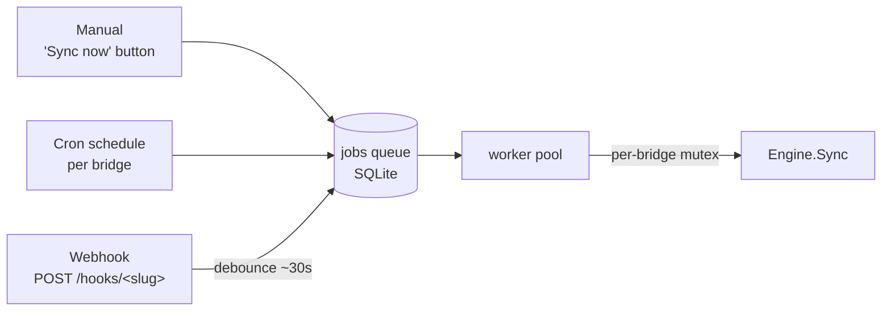
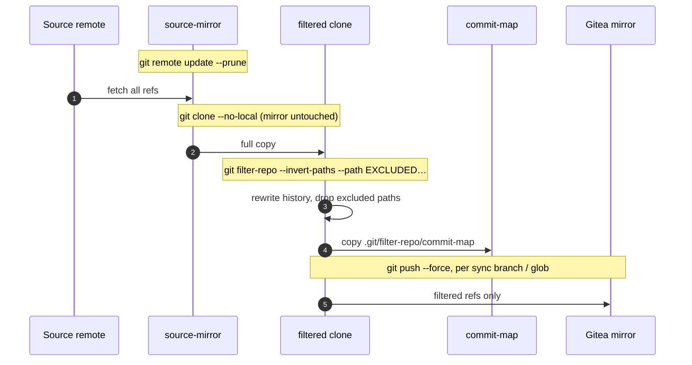
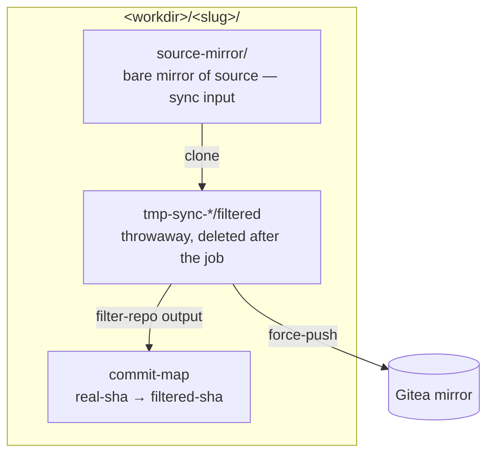

# How sync works

Sync is the **source → Gitea** direction of a bridge: it takes the real
repository, strips the excluded paths out of the *entire* history with
`git filter-repo`, and force-pushes the filtered result to the private Gitea
mirror that agents work against. It is the **only** operation in Sluice that
writes to Gitea, and it only ever pushes filter-repo output — an unfiltered
ref can never reach the mirror by construction
([spec §9.2](../spec.md)).

This document describes the implementation in
[`internal/engine/sync.go`](../internal/engine/sync.go) (`Engine.Sync`) and
its orchestration in [`internal/jobs/jobs.go`](../internal/jobs/jobs.go)
(`runSync`).

## Triggers

A sync is enqueued as a background job from three places, then runs through
the same code path:

- **Manual** — `POST /bridges/<slug>/sync`.
- **Cron** — the bridge's `schedule_cron`, registered while the bridge is
  `active`.
- **Webhook** — `POST /hooks/<slug>` authenticated by the per-bridge secret;
  bursts are coalesced with a ~30s debounce so a flurry of pushes produces a
  single sync.

Jobs for one bridge are **serialized** (a per-bridge mutex): sync, promote
and finalize never run concurrently for the same bridge. Different bridges
run in parallel on a bounded worker pool.

## The sync sequence

Step by step, exactly as the code runs it:

1. **Validate** the excluded paths (plain relative dirs; no globs, regex
   metacharacters, leading `/`, or `..`). A bad filter fails before anything
   touches git.
2. **Update the mirror** — `git -C source-mirror remote update --prune`.
   `source-mirror` is the bare mirror created at init (`git clone --mirror`).
   If git reports a `forced update`, the upstream history was rewritten; the
   job log warns because filtered SHAs for the rewritten range will change
   (see *Determinism* below).
3. **Fresh clone for filtering** — `git clone --no-local source-mirror
   tmp-sync-*/filtered`. `--no-local` gives `git filter-repo` the clean clone
   it requires and keeps the mirror's object store untouched. The temp
   directory lives inside the bridge workspace and is removed when the job
   ends.
4. **Filter** — `git filter-repo --invert-paths --path 
` for each excluded
   path. This rewrites the whole history, removing those paths from every
   commit, tree and blob, and drops commits that touched only excluded paths.
5. **Store the commit-map** — copy `.git/filter-repo/commit-map`
   (lines: `<real-sha> <filtered-sha>`) to `<workspace>/commit-map`. This
   mapping is what lets a later promotion translate a filtered base commit
   back to the real one.
6. **Add the Gitea remote** — `git remote add gitea <gitea_ssh_url>` in the
   filtered clone.
7. **Force-push branches** — for each configured sync branch, validate the
   ref name (`git check-ref-format`) and
   `git push --force gitea refs/heads/<b>:refs/heads/<b>`.
8. **Force-push globs** — for each configured ref glob,
   `git push --force gitea <glob>:<glob>`, best-effort (a glob may match
   nothing, which is not an error).
9. **Finalization pass** — after a successful sync the job runs finalization
   (detects promotions that have landed upstream and cleans them up). See
   [promotion/finalization docs] — covered separately.

The force-push is safe specifically because filter-repo is **deterministic**
(next section).

## Why force-push is safe: determinism

Re-running `git filter-repo` with the **same** excluded paths over extended
history produces **identical** filtered SHAs for the commits it has already
seen. So each sync only appends new commits on top of an unchanged filtered
history — the force-push fast-forwards in practice, and agent branches based
on earlier filtered commits stay valid.

Two things break this contract, and Sluice handles both:

- **Upstream history rewrite** (force-push on the source): detected in step 2
  and flagged in the log; filtered SHAs for the rewritten range change.
- **Changing the bridge's excluded paths**: this changes *all* filtered SHAs.
  The settings page requires typed confirmation, then triggers a full re-sync
  and marks open promotions as needing attention.

## Workspace and data touched

`source-work/` and `gitea-clone/` (used by promotion) are **not** touched by
sync. Only `source-mirror` is read and only the throwaway filtered clone
pushes to Gitea, which is what structurally guarantees that nothing
unfiltered can reach the mirror.

## Operational details

- Every git command runs as an **argv array** (no shell interpolation), with
  a timeout, and its output is appended to the job log after **secret
  scrubbing** (Gitea token, webhook secret, SSH key material are redacted).
- SSH uses the bridge's key (or the mounted default) and the managed,
  **pinned** `known_hosts`; host keys are never auto-accepted.
- On success the bridge's "last sync" timestamp/result is recorded and an
  audit entry is written. On failure the job is marked `failed` with the
  error summary and the captured log.
- A crash mid-sync is safe: the temp clone is disposable and the mirror's
  object store was never modified, so the next sync starts clean.

## At a glance

| | |
| --- | --- |
| Entry point | `Engine.Sync` (`internal/engine/sync.go`) |
| Orchestration | `Service.runSync` (`internal/jobs/jobs.go`) |
| Input | `source-mirror` (bare mirror of the source) |
| Output | force-pushed filtered branches/globs on the Gitea mirror |
| Side output | `<workspace>/commit-map` (used by promotion) |
| Triggers | manual, cron, webhook (debounced ~30s) |
| Concurrency | per-bridge mutex; bridges parallel on a worker pool |
| Reference | [spec §12.1](../spec.md) |
